# Statistics Cookbook
A Statistics Cookbook for my dear colleagues in science and engineering. Practical recipes for applying statistical modelling and data analysis that are most often used in our work.

## Implementation
Two software platforms are used here, JMP and Python, for all the calculations. The results from both platforms are presented side by side.
```
JMP 15.0.0
```
```Python
Python 3.7.7 Windows10
import pandas
import seaborn
import probscale
import pingouin
import bioinfokit
import statsmodels
```

## Comparison experiments under the hypothesis testing framework

**Quick Navigation**
- How to select the most appropriate statistical test for comparison
  - [Choice of Statistical Test](#choice-of-statistical-test)
- What is the appropriate number of repeats
  - [Choice of Sample Size](#choice-of-sample-size)
- Not sure if a single mean reaches a target value
  - [The One-Sample t-Test](#the-one-sample-t-test)
- Not sure if two means are different
  - [The Independent Two-Sample t-Test](#the-independent-two-sample-t-test)
  - [The Welch's t-Test](#the-welchs-t-test)
  - [The Paired Two-Sample t-Test](#the-paired-two-sample-t-test)
- I know the two means are different, but how much do they differ
  - [Confidence Intervals](#confidence-intervals)
- Let's check the equality of several means
  - Fixed effects model: [One-Way Analysis of Variance (ANOVA)](#one-way-analysis-of-variance-anova)
  - Random effects model: [Restricted Maximum Likelihood Method (REML)](#restricted-maximum-likelihood-method-reml)
---

### Choice of Statistical Test
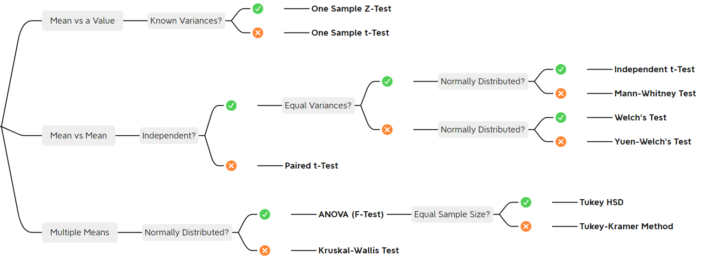

Some key points:
- For all the examples presented below, the dependent variables are continuous, in order to assure the assumptions of normality and homogeneity of variances.
- Most of the time, the independent variables are treated as categorical.

### Compare a Single to a Specified Value
Application example: assess if one property of the products exceeds the standard requirement

##### Steps
1. Check the if the variance is known, decide which t-test to use
2. Calculate the t-test statistic, degree of freedom, and p-value
3. Conclude rejecting (usually when **p-value < 0.05**) or failing to reject the null hypothesis

#### The One-Sample t-Test
##### Assumptions
- The normality assumption: the population can be described by a normal distribution
- The variance is unknown
- The null hypothesis is that the mean is equal to the specified value

>**Example 0** determines if the mean turning circle of cars is equal to 40

1. The variance is unknown, so we select the one-sample t-test
2. The t-test statistic
```
JMP
Analyze -> Distribution
> Test Mean
```
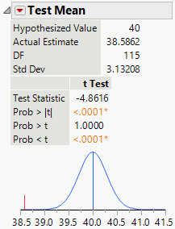
- t-test statistic is **Test Statistic** = -4.8616
- Degree of freedom is **DF** = 115
- For a two-tailed test, p-value is **Prob >|t|** < 0.0001
```Python
Python
import pandas as pd
from scipy import stats
# Import data
raw_data = pd.read_excel('Example0-Car-Physical-Data.xlsx')
# Run one-sample t-test
t_stats, pvalue = stats.ttest_1samp(raw_data['Turning Circle'], popmean = 40)
```
- t-test statistic is **t_stats** = -4.861638614283709
- p-value is **pvalue** = 3.7207722421486783e-06
3. Conclusions: based on the p-value, we reject the null hypothesis, meaning the mean turning circle of cars does not reach 40.

### Randomised Designs
Application example: comparing the properties of two materials manufactured via the same method

##### Steps
1. Check the normality assumption and the equal variance assumption using a normal probability plot, decide which t-test to use
2. Calculate the t-test statistic, degree of freedom, and p-value
3. Conclude rejecting or failing to reject the null hypothesis

#### The Independent Two-Sample t-Test
##### Assumptions
- The independence assumption: both samples are random samples that are drawn from two independent populations
- The normality assumption: both populations can be described by a normal distribution
- The equal variance assumption: the variances or the standard deviation of both responses are identical
- The null hypothesis is that the means are equal

>**Example 1** compares two formulations of a cement

1. The normal probability plot
```
JMP
Analyze -> Fit Y by X
> Normal Quantile Plot -> Plot Quantile by Actual
```
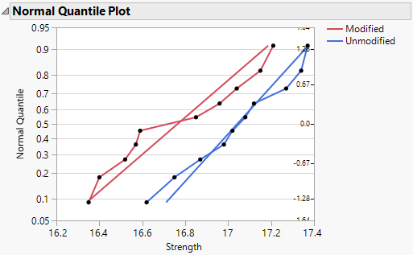
```Python
Python
import pandas as pd
import seaborn
import probscale
# Import data
raw_data = pd.read_excel('Example1-Cement.xlsx')
# Plot the normal probability plot
fig = (
    seaborn.FacetGrid(data=raw_data, hue='Formulation', height=4)
        .map(probscale.probplot, 'Strength', probax='y', bestfit=True)
        .set_ylabels('Probability')
        .add_legend()
        )
```
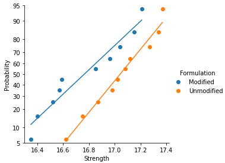
- If it is linear approximately between the 25th and 75th percentile points, then the hypothesized normal distribution adequately describes the data.
- If both lines have similar slopes, then the equal variance assumption is validate. It this assumption is violated, the version of t-test in **Example 2** should be used.
2. The t-test statistic
```
JMP
Analyze -> Fit Y by X
> Means/Anova/Pooled t
```
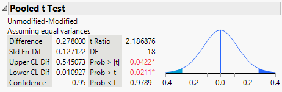
- t-test statistic is **t Ratio** = 2.186876
- Degree of freedom is **DF** = 18
- For a two-tailed test, p-value is **Prob >|t|** = 0.0422
```Python
Python
import pandas as pd
from scipy import stats
from math import sqrt
from scipy.stats import t
# Import data
raw_data = pd.read_excel('Example1-Cement.xlsx')
group0 = raw_data['Formulation'] == 'Modified'
group1 = raw_data['Formulation'] == 'Unmodified'
# Run independent t-test
t_stats, pvalue = stats.ttest_ind(
    raw_data['Strength'][group1],raw_data['Strength'][group0],
    axis=0, equal_var=True
                   )
```
- t-test statistic is **t_stats** = 2.1868757949582633
- p-value is **pvalue** = 0.042196715924889903
3. Conclusions: based on the p-value, we reject the null hypothesis, meaning that the modified formulation significantly reduces the strength.

#### Confidence Intervals
For JMP, repeat the step in calculating the t-test statistic, the 95 % confidence interval estimate on the difference in means extends from 0.010927 (**Lower CL Dif**) to 0.545073 (**Upper CL Dif**). The results reveal how much the mean strength of the unmodified formulation exceeds the mean strength of the modified formulation, and 95 % represents the precision of estimation of the difference in the two means.

For Python, attach the following code to the above code block:
```Python
Python
# Calculate the mean difference and 95% confidence interval
N0 = len(list(filter(None, group0)))
N1 = len(list(filter(None, group1)))
df = (N0 + N1 - 2)
std0 = raw_data['Strength'][group0].std()
std1 = raw_data['Strength'][group1].std()
std_N0N1 = sqrt( ((N0 - 1)*(std0)**2 + (N1 - 1)*(std1)**2) / df)
diff_mean = raw_data['Strength'][group1].mean() - raw_data['Strength'][group0].mean()
MoE = t.ppf(0.975, df) * std_N0N1 * sqrt(1/N0 + 1/N1)
lb = diff_mean - MoE
ub = diff_mean + MoE
```
The 95 % confidence interval estimate on the difference in means extends from 0.010926612232162347 (**lb**) to 0.5450733877678422 (**ub**).
#### Choice of Sample Size
By calculating the length of the confidence interval, it can be concluded that in general, choosing a sample size of **n >= 10** from each population in a two-sample 95 % confidence interval will result in the possible best precision of estimation for the difference in the two means.

For expensive tests, the choice of sample size can be made using the power curve regarding a predetermined "critical" difference in means that one wish to detect.

#### The Welch's t-Test
##### Assumptions
- The independence assumption: both samples are random samples that are drawn from two independent populations
- The normality assumption: both populations can be described by a normal distribution
- The variances or the standard deviation of both responses **cannot** reasonably assume to be identical
- The null hypothesis is that the means are equal

>**Example 2** compares the normalized fluorescence after two
hours for nerve and muscle tissue for 12 mice

1. The normal probability plot
```
JMP
Analyze -> Fit Y by X
> Normal Quantile Plot -> Plot Quantile by Actual
```
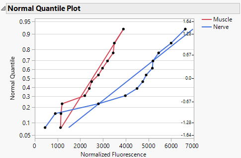
```Python
Python
import pandas as pd
import seaborn
import probscale
raw_data = pd.read_excel('Example2-Florescence.xlsx')
fig = (
    seaborn.FacetGrid(data=raw_data, hue='Tissue', height=4)
        .map(probscale.probplot, 'Normalized Fluorescence', probax='y', bestfit=True)
        .set_ylabels('Probability')
        .add_legend()
        )
```
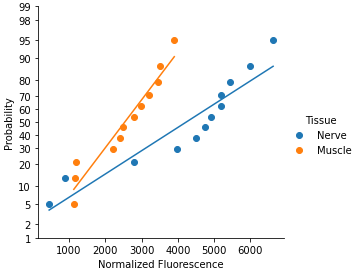
- If it is linear approximately between the 25th and 75th percentile points, then the hypothesized normal distribution adequately describes the data.
- If both lines have different slopes, then the equal variance assumption is violated. The **Welch’s t-test** should be used.
2. The Welch’s t-test statistic
```
JMP
Analyze -> Fit Y by X
> t-Test
```
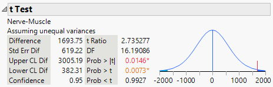
- t-test statistic is **t Ratio** = 2.735277
- Degree of freedom is **DF** = 16
- For a one tail test, p-value is **Prob > t** = 0.0073
```Python
Python
import pandas as pd
from scipy import stats
# Import data
raw_data = pd.read_excel('Example2-Florescence.xlsx')
group0 = raw_data['Tissue'] == 'Nerve'
group1 = raw_data['Tissue'] == 'Muscle'
# Run Welch's t-test
t_stats, pvalue = stats.ttest_ind(
    raw_data['Normalized Fluorescence'][group0],raw_data['Normalized Fluorescence'][group1],
    axis=0, equal_var=False
                   )
```
- t-test statistic is **t_stats** = 2.7352769763624623
- p-value is half of **pvalue** = 0.0072776442038488855
3. Conclusions: based on the p-value, we reject the null hypothesis, meaning that the mean fluorescence for nerve is significantly greater than the mean fluorescence for muscle tissue.

### Paired Comparison Designs
Application example: comparing the properties of one material before and after certain treatment

##### Steps
1. Calculate the t-test statistic, degree of freedom, and p-value
2. Conclude rejecting or failing to reject the null hypothesis

#### The Paired Two-Sample t-Test
##### Assumptions
- The dependence assumption: both samples are random samples that are drawn from two dependent populations
- The normality assumption: both populations can be described by a normal distribution
- The equal variance assumption: the variances or the standard deviation of both responses are identical
- The null hypothesis is that the means are equal

>**Example 3** compares the true difference between two tips for hardness measurements. To minimise the inflation of experimental error caused by the specimens, two tips were used on each single specimen.

1. The paired t-test statistic
```
JMP
Analyze -> Specialized Modeling -> Matched Pairs
```
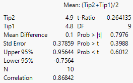
- t-test statistic is **t Ratio** = 0.264135
- Degree of freedom is **DF** = 9
- For a two-tailed test, p-value is **Prob > |t|** = 0.7976
```Python
Python
import pandas as pd
from scipy import stats
# Import data
raw_data = pd.read_excel('Example3-Hardness.xlsx')
# Run paired t-test
t_stats, pvalue = stats.ttest_rel(raw_data['Tip2'], raw_data['Tip1'])
```
- t-test statistic is **t_stats** = 0.26413527189768715
- p-value is **pvalue** = 0.7976245209721027
```Python
Python
# Or use the very powerful package 'pingouin'!
import pingouin as pg
stats = pg.ttest(raw_data['Tip2'], raw_data['Tip1'],paired=True)
```
- t-test statistic is **stats['T']** = 0.264135
- Degree of freedom is **stats['dof']** = 9
- p-value is **stats['p-val']** = 0.797625
2. Conclusions: based on the p-value, we cannot reject the null hypothesis at any reasonable level of significance, meaning the measurements from these two tips are not significantly different.

### Analysis of Variance
Application example: comparing the effects of multiple settings of a single parameter on one property.

##### Steps
1. Check the model adequacy using residual plots.
2. Calculate the test statistic, degree of freedom, and p-value.
3. Conclude rejecting or failing to reject the null hypothesis.
4. Find out which specific means are different by solving the multiple comparisons problem. For example by Tukey's HSD method (i.e. pairwise t-tests on means).

#### One-Way Analysis of Variance (ANOVA)
For fixed effects model, where the treatments are specifically chosen by the experimenter. The conclusions cannot be extended to similar treatments that were not explicitly considered.

##### Assumptions
- The normality and independence assumptions: the model errors are assumed to be normally and independently distributed random variables with mean zero and variance .
- The constant variance assumption: the variance  is assumed to be constant for all levels of the factor. If this assumption is violated, a variance-stabilising transformation should be applied.
- The null hypothesis is that all means are equal.

>**Example 4** compares the effect of four levels of RF power on etch rate for a single wafer plasma etching tool.

1. The normal probability plot of residuals to check the normality
```
JMP
Analyze -> Fit Model
> Row Diagnostics -> Plot Residual by Normal Quantiles
```
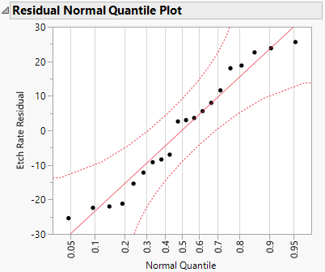
```Python
Python
import pandas as pd
from bioinfokit.analys import stat
import statsmodels.api as sm
import matplotlib.pyplot as plt
# Import data
raw_data = pd.read_excel('Example4-Plasma-Etching.xlsx')
raw_data.columns = ['treatments', 'value']
# Run Tukey HDS test
res = stat()
res.tukey_hsd(df=raw_data, res_var='value', xfac_var='treatments', anova_model='value ~ C(treatments)')
# Make the residaul plot
sm.qqplot(res.anova_std_residuals, line='45')
plt.xlabel("Theoretical Quantiles")
plt.ylabel("Standardized Residuals")
plt.show()
```
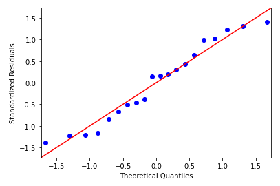
- If it is linear approximately between the 25th and 75th percentile points, then the analysis of variance is robust to the normality assumption.
- Standardised residuals are better for detecting outliners.

1. Plot of residual vs run order or time to check the independence and the constant variance assumptions
```
JMP
Analyze -> Fit Model
> Row Diagnostics -> Plot Residual by Row
```
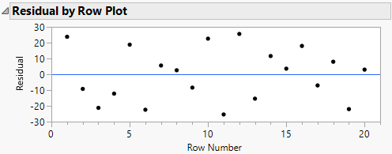
```Python
Python
# Plot residual vs run order
x = res.anova_model_out.resid.index + 1
y = res.anova_model_out.resid
plt.scatter(x, y)
plt.xlabel("Row Number")
plt.ylabel('Residual')
plt.show()
```
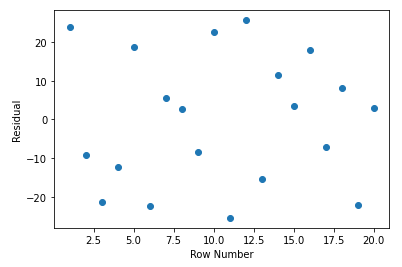
- We expect the plot to be random scatter instead of a funnel-shaped appearance.

1. Plot of residual vs fitted values to check the constant variance assumption
```
JMP
Analyze -> Fit Model
> Row Diagnostics -> Plot Residual by Predicted
```
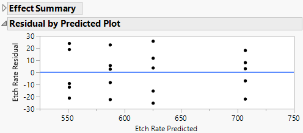
```Python
Python
# Plot residual vs fitted value
x = res.anova_model_out.fittedvalues
y = res.anova_model_out.resid
plt.scatter(x, y)
plt.xlabel("Predicted")
plt.ylabel('Residual')
plt.show()
```
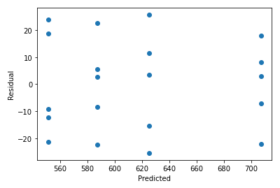
- We expect the plot to be random scatter instead of a funnel-shaped appearance.

2. The ANOVA test statistic
```
JMP
Analyze -> Fit Y by X
> Means/Anova
```
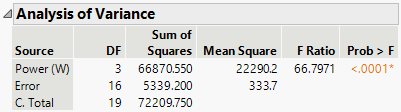
- F-test statistic is **F Ratio** = 66.7971
- p-value is **Prob > F** < 0.0001
```Python
Python
import pandas as pd
from scipy import stats
# Import data
raw_data = pd.read_excel('Example4-Plasma-Etching.xlsx')
group0 = raw_data['Power (W)'] == 160
group1 = raw_data['Power (W)'] == 180
group2 = raw_data['Power (W)'] == 200
group3 = raw_data['Power (W)'] == 220
# Run one-way ANOVA test
fvalue, pvalue = stats.f_oneway(raw_data['Etch Rate'][group0],raw_data['Etch Rate'][group1],
                               raw_data['Etch Rate'][group2],raw_data['Etch Rate'][group3])
```
- F-test statistic is **fvalue** = 66.79707321945864
- p-value is **pvalue** = 2.882865908493268e-09

3. Conclusions: based on the p-value, we reject the null hypothesis, meaning the power is a significant effect for etch rate.
4. Compare means by Tukey's HDS test
```
JMP
Analyze -> Fit Y by X
> Compare Means -> All Pairs, Tukey HSD
```
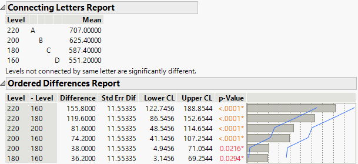
- The **Connecting Letters Report** shows which levels are significantly different.
- The confidence intervals are from **Lower CL** to **Upper CL**.
- p-value between each pair is **p-Value**.
```Python
Python
# Use the very powerful package 'bioinfokit'!
import pandas as pd
from bioinfokit.analys import stat
# Import data
raw_data = pd.read_excel('Example4-Plasma-Etching.xlsx')
raw_data.columns = ['treatments', 'value']
# Run Tukey HDS test
res = stat()
res.tukey_hsd(df=raw_data, res_var='value', xfac_var='treatments', anova_model='value ~ C(treatments)')
df1 = res.tukey_summary.sort_values(by=['Diff'], ascending=False)
df1.style
```
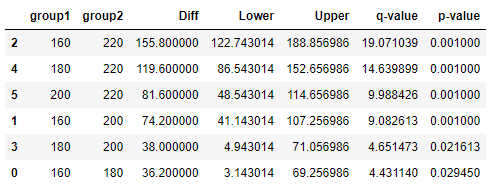
- The confidence intervals are from **Lower** to **Upper**.
- p-value between each pair is **p-value**.
- The Tukey-Kramer method will be automatically adopted if the sample sizes are unequal among the groups.

#### Restricted Maximum Likelihood Method (REML)
For random effects model, where the treatments are randomly selected from a larger population of treatments. The conclusions can be extended to all treatments in the population.

##### Assumptions
- The population of treatments is assumed to be either infinite or large enough to be considered infinite.
- It does not require the normality assumption.
- The null hypothesis is that the variance component  equals to zero, meaning all treatments are identical.

>**Example 5** examines if the looms are homogeneous by randomly selecting four out of many looms and measure its fabric strengthes.

1. The REML variance components analysis
```
JMP
Analyze -> Fit Model
> Attributes -> Random Effect
```
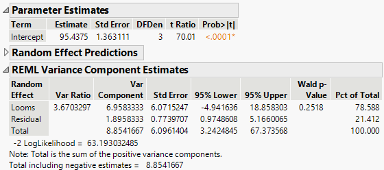
- The p-value is **Prob > |t|** < 0.0001
- The variance component of the loom itself is 6.9583333, which comprise 78.588 % of the total variance.
```Python
Python
import pandas as pd
import statsmodels.api as sm
# Import data
raw_data = pd.read_excel('Example5-Fabric.xlsx')
# Run the REML variance components analysis
fml = "Strength ~ 1"
vcf = {"Looms": "0 + C(Looms)"}
model = sm.MixedLM.from_formula(fml, vc_formula=vcf, groups="Looms", data=raw_data)
result = model.fit(method='powell')
print(result.summary())
```
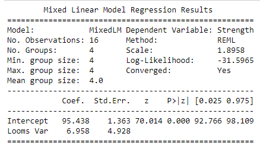
- The p-value is **P>|z|** < 0.0001
- The variance component of the loom itself is 6.958, which is significantly larger than that of the residual as 1.8958.

2. Conclusions: based on the p-value, we reject the null hypothesis, meaning there are significant differences among the looms. Because the variance component of the loom itself contributes to almost 80 % of the total variance, most of the variability is due to differences between the looms, meaning the looms are not homogeneous.
